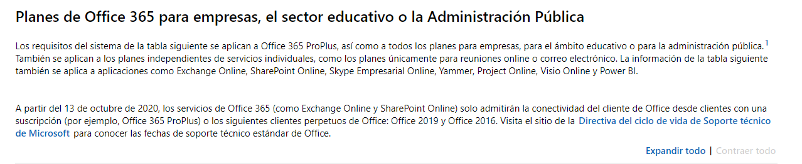

|   [Manifesto](https://polo-software-libre-na-educacion-galega.github.io/Manifesto/)	|   [Asinantes](https://polo-software-libre-na-educacion-galega.github.io/Manifesto/Asinantes)	|    [Como apoiar o manifesto](https://polo-software-libre-na-educacion-galega.github.io/Manifesto/Apoiar)	|   [Contacto](https://polo-software-libre-na-educacion-galega.github.io/Manifesto/Conctacto)	| [Novas](https://polo-software-libre-na-educacion-galega.github.io/Manifesto/Novas)	|    

# O Office365 non é gratis para a Xunta!! A Conselleria de Educación e a AMTEGA menten. 
Na web de [Microsoft](https://products.office.com/es-es/office-system-requirements#coreui-contentrichblock-cs9mei4) dise claramente que o 
Office365 será de pago para o sector educativo e as administracións públicas. Microsoft indica que o servizo será preciso 
ter contratado unha subscripción dende o 13 de outubro de 2020.

