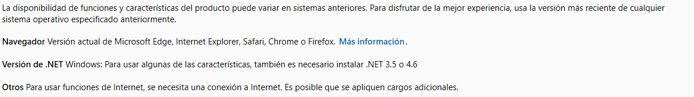

|   [Manifesto](https://polo-software-libre-na-educacion-galega.github.io/Manifesto/)	|   [Asinantes](https://polo-software-libre-na-educacion-galega.github.io/Manifesto/Asinantes)	|    [Como apoiar o manifesto](https://polo-software-libre-na-educacion-galega.github.io/Manifesto/Apoiar)	|   [Contacto](https://polo-software-libre-na-educacion-galega.github.io/Manifesto/Conctacto)	| [Novas](https://polo-software-libre-na-educacion-galega.github.io/Manifesto/Novas)	|    

# O Office365 non é compatible con outros sistemas operativos.
Os diferentes clientes de Office365 indican que o paquete ofimático na nube é totalmente compatible con calquera sistem operativo. 
Máis as indicación de Microsoft indican que diveras funcionalidades precisan instalar diferentes de versións de .net só para Windows.

[Web de Microsoft coa información](https://products.office.com/es-es/office-system-requirements#coreui-contentrichblock-cs9mei4)